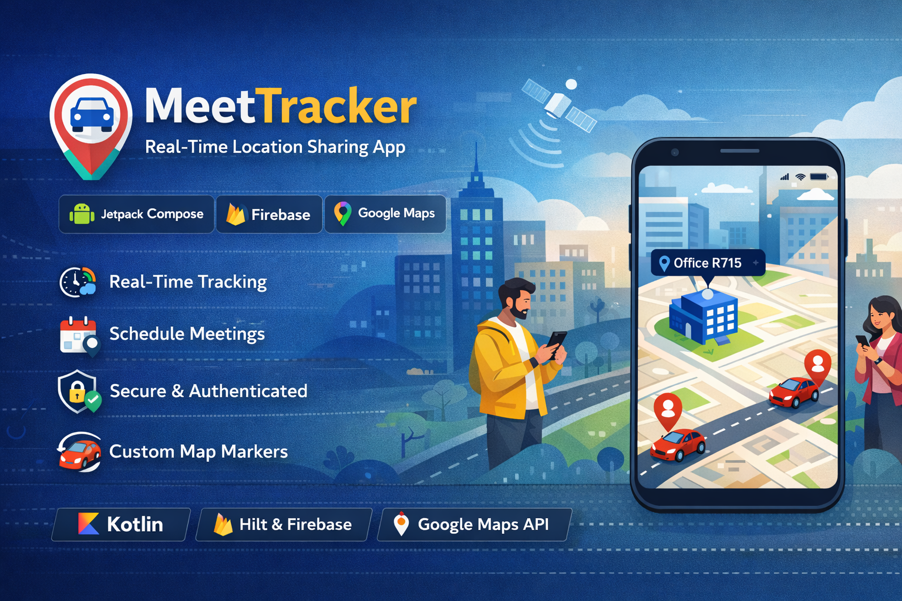

<p align="center">
  
</p>

<h1 align="center">📍 MeetTracker App 🚗</h1>

<p align="center">
  Real-Time Location Sharing & Meeting Tracking App
</p>

<p align="center">
  
  
  
  
</p>

 **MeetTracker** is a real-time location-sharing Android application built using Jetpack Compose, Firebase Realtime Database, and Google Maps API.
The app allows users to schedule meetings and track participants' live movements on a map with custom markers.

---

## 🚀 Features

* 📡 **Real-time Tracking**
  Watch participants move on the map with low-latency updates (every 2 seconds)

* 📅 **Meeting Scheduling**
  Create meetings with types (Business, Personal, etc.), reasons, and target location directly from the map

* 📍 **Custom Map Markers**
  Uses BitmapDescriptors to show car or person icons instead of default markers

* 🧭 **Auto-Rotation**
  Markers rotate based on direction of travel (bearing)

* 🔐 **Secure Integration**
  Firebase Authentication + Realtime Database

* 🎨 **Modern UI**
  Built with Material 3 and Jetpack Compose

---

## 🛠 Tech Stack

* **Language:** Kotlin
* **Architecture:** MVVM (Model-View-ViewModel)
* **UI Framework:** Jetpack Compose
* **Dependency Injection:** Hilt (Dagger)
* **Database:** Firebase Realtime Database
* **Maps:** Google Maps Compose Library
* **Location:** FusedLocationProvider (Google Play Services)

---

## 📦 Project Structure

```
com.anniyam.meettrackerapp
├── data                # Firebase data models & repositories
├── di                  # Hilt modules for dependency injection
├── presentation
│   ├── screen          # MapScreen, MeetingScheduleScreen, MapPicker
│   └── viewmodel       # Handles location & Firebase logic
└── ui                  # Theme and global UI components
```

---

## ⚙️ Setup & Installation

### 1. Prerequisites

* Android Studio (Ladybug or newer)
* Google Cloud Project with Maps SDK enabled
* Firebase Project

---

### 2. Firebase Configuration

1. Create a project in Firebase Console
2. Add Android app with package name:
   `com.anniyam.meettrackerapp`
3. Download `google-services.json`
4. Place it inside the `app/` directory
5. Enable **Realtime Database** and use rules (for testing):

```json
{
  "rules": {
    ".read": "auth != null",
    ".write": "auth != null"
  }
}
```

---

### 3. Google Maps API Key

1. Get API Key from Google Cloud Console
2. Open:

```
app/src/main/AndroidManifest.xml
```

3. Add your key:

```xml
<meta-data
    android:name="com.google.android.geo.API_KEY"
    android:value="YOUR_API_KEY_HERE" />
```

---

## 📸 Usage

1. 📅 **Schedule a Meeting**
   Enter meeting type and reason, then pick a location from the map

2. 🔗 **Join Meeting**
   Share the generated Meeting ID with participants

3. 🗺️ **Track Users**
   View all participants on the map with live movement updates

---

## 🤝 Contributing

Contributions are welcome!
Feel free to fork the repo and submit a Pull Request.

---

## 📜 License

Distributed under the **MIT License**.
See `LICENSE` file for more details.

---

## 👩‍💻 Author

**Gomathi Selvakumar**

---

## ⭐ Support

If you like this project, don’t forget to give it a ⭐ on GitHub!
